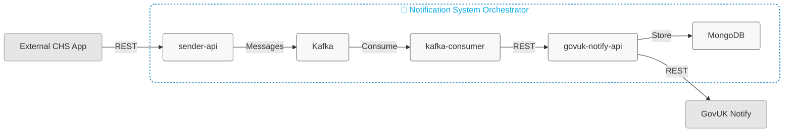

# Notification Docker Orchestrator

Docker Compose setup that orchestrates the entire notification system.

## Quick Start

1. Copy `.env.example` to `.env` and update with your repository paths
2. Run `./build.sh` to build all services
3. Run `docker-compose up -d` to start everything

## Services

- Kafka (9092)
- MongoDB (27017)
- Notification Sender API (8081)
- Notification Kafka Consumer (8082)
- GOV.UK Notify Integration API (8083)

Stop with `docker-compose down`
